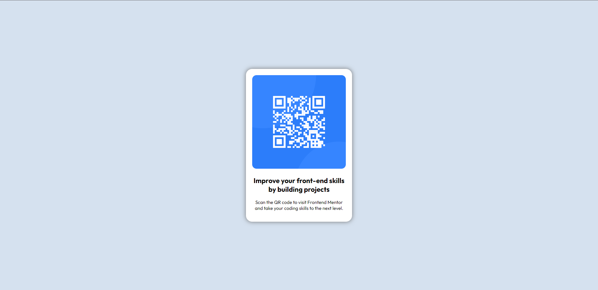

# Frontend Mentor - QR code component solution

This is a solution to the [QR code component challenge on Frontend Mentor](https://www.frontendmentor.io/challenges/qr-code-component-iux_sIO_H). Frontend Mentor challenges help you improve your coding skills by building realistic projects. 

## Table of contents

- [Overview](#overview)
  - [Screenshot](#screenshot)
  - [Links](#links)
- [My process](#my-process)
  - [Built with](#built-with)
  - [What I learned](#what-i-learned)
  - [Continued development](#continued-development)
  - [Useful resources](#useful-resources)
- [Author](#author)
- [Acknowledgments](#acknowledgments)

## Overview

This project took me roughly 20 minutes to complete. I did google some things to make it more efficient afterwards. ie ensuring the QR Section would be exactly center on all devices.

I also added a shadow, because I like them.

### Screenshot

Completed screenshot above of my finished project.

### Links

- Solution URL: [Add solution URL here](https://your-solution-url.com)
- Live Site URL: [Add live site URL here](https://your-live-site-url.com)

## My process

### Built with

- Semantic HTML5 markup
- CSS custom properties

### What I learned

The following code is an element that I found that enabled me to enure the section was exactly centred on all devices. This is something I had not used before.

  position: absolute;
  top: 50%;
  left: 50%;
  -ms-transform: translate(-50%, -50%);
  transform: translate(-50%, -50%);

If you want more help with writing markdown, we'd recommend checking out [The Markdown Guide](https://www.markdownguide.org/) to learn more.

### Continued development

//

### Useful resources

- [w3 Schools](https://www.w3schools.com/howto/howto_css_center-vertical.asp) - I found this, that enabled me to enure the section was exactly centred on all devices. This is something I had not used before.

## Author

BPark

## Acknowledgments

//
